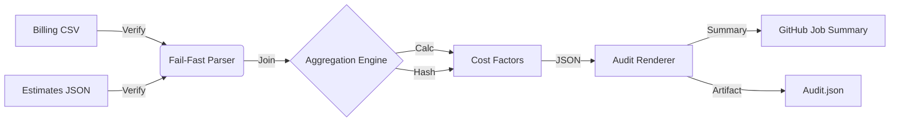

# FinOps Validation Architecture

This document describes the architectural design of the **FinOps Validation Suite** within `llm-cost`.

## 1. System Overview

The Validation Suite is designed to provide **audit-grade confidence** in cost allocations. It operates as a distinct layer above the core estimation engine, treating cost reports as **contracts** that must be deterministically verified.

### Components

1.  **Core Engine (`src/calibrate/`)**:
    *   **Logic**: Zig-based high-performance join and aggregation.
    *   **Traceability**: Generates SHA256 hashes of all input data (`estimates_sha256`, `actuals_sha256`).
    *   **Safety**: Implements "Fail-Fast" policy (Code 2) on schema violations.

2.  **Test Harness (`scripts/finops/`)**:
    *   **P0 Suite**: Gatekeeper (PR level). Verifies determinism, drift < 0.00%, and schema enforcement.
    *   **P1 Suite**: Scale & Quality (Main level). Verifies UTF-8 compliance, duplicate aggregation, and 2000+ cardinality.
    *   **Heavy Suite**: Performance (Nightly). Verifies 1M+ row throughput within RSS/Time budgets.

3.  **Reporting Layer (`tools/finops/`)**:
    *   **Renderer**: Python-based artifact generator.
    *   **Output**: Structured JSON (`audit.json`) for data reliability engineering (DRE) platforms.

## 2. Data Flow

## 3. Compliance Standards

### Determinism
The engine guarantees bit-exact output for identical inputs, independent of concurrency or platform.
*   **Mechanism**: `std.sort` on final keys before output.
*   **Verification**: Comparison against committed golden `factors.toml` hashes.

### Schema Integrity
All inputs and outputs adhere to **FOCUS v1.1** draft specifications.
*   **Estimates**: Version 2 Schema (Typed `cost_micro`).
*   **Actuals**: Strict column validation (`ResourceId`, `BilledCost`, `ChargePeriodStart`).

### Audit Trail
Every run produces an `audit.json` containing:
*   `commit`: Git SHA of the logic.
*   `policy`: Active failure policy and drift thresholds.
*   `results`: Boolean pass/fail and quantitative drift (BPS).
